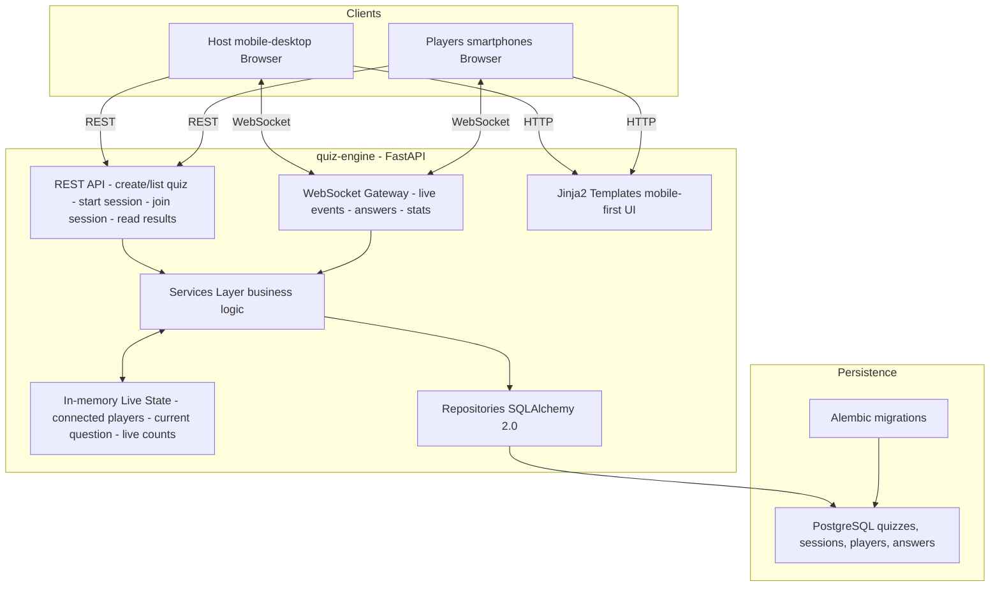

# quiz-engine

[](https://github.com/ChristianPRO1982/quiz-engine/releases/latest)


[](https://www.python.org/)


🇬🇧 EN:  Lightweight FastAPI-based quiz engine with REST APIs and WebSockets for running live quiz sessions on smartphones.

🇫🇷 FR: Moteur de quiz temps réel basé sur FastAPI, utilisant des API REST et WebSockets pour des sessions live sur smartphones.

## General architecture for quiz-engine (FastAPI + REST + WebSocket + PostgreSQL)



## Database migrations (Alembic)

- `DATABASE_URL` is required and must point to the shared PostgreSQL database.
- Only `qe_*` tables (plus `qe_alembic_version`) are managed by this service.

Create a migration:

```bash
uv run alembic revision --autogenerate -m "create qe_* core tables"
```

Apply migrations:

```bash
uv run alembic upgrade head
```

Rollback one migration:

```bash
uv run alembic downgrade -1
```

## i18n (gettext)

- Sources live in `quiz_engine/i18n/locales/*/LC_MESSAGES/messages.po`.
- Consent texts use versioned keys like `consent.pseudo.v1.body`.

Extract and update catalogs:

```bash
uv run pybabel extract -F babel.cfg -k _ -k t -o quiz_engine/i18n/locales/messages.pot .
uv run pybabel update -i quiz_engine/i18n/locales/messages.pot -d quiz_engine/i18n/locales -l en -l fr
```

Compile catalogs:

```bash
uv run pybabel compile -d quiz_engine/i18n/locales
```
