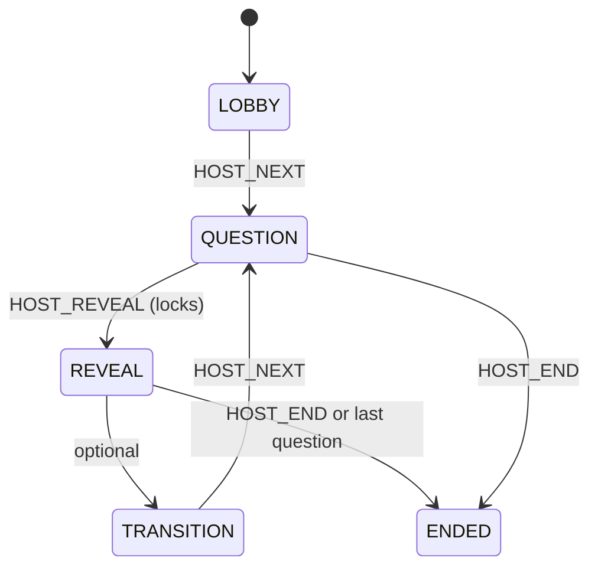
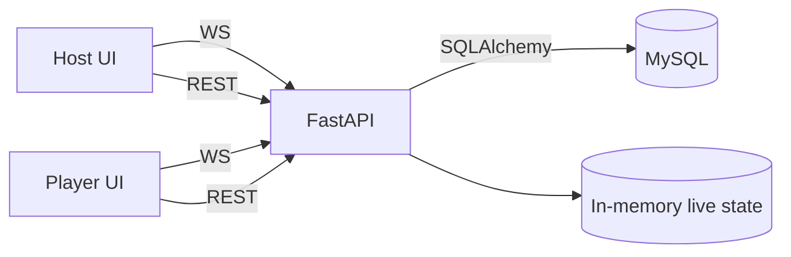

# Quiz Engine — Architecture (Phase 0)

## Goals

- Mobile-first live quiz for small groups (10–80 players).
- FastAPI REST for CRUD + session lifecycle.
- WebSocket for live events (host control + player answers + live stats).
- MySQL persistence for replays and audit.
- Live runtime state in RAM (authoritative during play), persisted results in DB.

Non-goals (for now):
- Scaling to thousands of concurrent players.
- Complex auth (JWT/OAuth).
- Advanced question types beyond the initial MVP.


## Domain Overview

### Content domain (Quiz)

A quiz contains questions. A question is renderable through a **single contract**:
- `kind` defines how the UI renders and collects an answer.
- `config` is a JSON object specific to the `kind`.
- `choices` is optional depending on `kind`.
- `media` is optional (image later).

This makes new question types additive without breaking existing flows.


### Runtime domain (Session)

A session is a live run of a quiz:
- Host starts a session, gets a `session_code` + `host_token`.
- Players join via QR or code, choose a nickname.
- Session progresses through phases (lobby → question → reveal → …).
- Answers are collected live (WebSocket), stored in DB, and aggregated for stats.

Live state is stored in RAM keyed by `session_code`.
DB remains the source of truth for replay and history.


## Session Phases (State Machine)

Phases are explicit and drive UI screens:
- `LOBBY`:
  - Players join, host sees participant count.
- `QUESTION`:
  - A question is active, answers accepted (unless locked).
- `REVEAL`:
  - Answers locked, aggregated stats shown, optional correct answer revealed.
- `TRANSITION`:
  - Optional slide between questions (countdown, meme, instructions).
- `ENDED`:
  - Session is finished, replay is available.

Transitions:
- LOBBY -> QUESTION (host starts / next question)
- QUESTION -> REVEAL (host reveals; locks answers)
- REVEAL -> TRANSITION (optional)
- TRANSITION -> QUESTION (next question)
- REVEAL -> ENDED (host ends, or last question)
- QUESTION -> ENDED (host ends early)

Invariant:
- Only one "current question" per session.
- Answers can be accepted only in `QUESTION` phase and when `locked=false`.


## Identifiers & Codes

### Session Code

- Human-friendly, short, unique: 6 alphanumeric uppercase (e.g. `A1B2C3`).
- Used in:
  - URL `/join/{session_code}`
  - displayed on host screen
  - WebSocket routing (room key)

### Host Token

- Random secret string returned on `start session`.
- Used by host REST calls and host WebSocket connection.
- Stored hashed (preferred) or plain for MVP (hash recommended in Phase 1/2).

### Player Identity

- `player_id` issued when joining.
- A player reconnect can be supported later (by reusing `player_id`).


## Data Model (Minimal DB)

The schema is optimized for:
- quiz authoring
- session play
- replay computation

### Entities

- `quiz`
  - id, title, created_at
- `question`
  - id, quiz_id, position, kind, prompt, media_url (nullable), config_json
- `choice`
  - id, question_id, position, label
- `session`
  - id, quiz_id, session_code, host_token_hash, status, started_at, ended_at
- `player`
  - id, session_id, nickname, joined_at
- `answer`
  - id, session_id, question_id, player_id, submitted_at
  - payload fields (MVP):
    - `choice_id` nullable (MCQ)
    - `value_text` nullable (future)
    - `value_number` nullable (future)

Notes:
- `question.kind` is an enum-like string:
  - MVP: `MULTIPLE_CHOICE`
  - Future: `YES_NO`, `SLIDER`, `FREE_TEXT`, etc.
- `question.config_json` stores per-kind options:
  - For slider: `{ "min": 0, "max": 100, "step": 5, "unit": "%" }`
  - For timed questions: `{ "time_limit_seconds": 15 }`
- For correctness/scoring:
  - keep optional fields for later:
    - `question.correct_choice_id` nullable
    - or `question.config_json.correct_choice_id` (less strict)


## REST Responsibilities (High-level)

REST is used for:
- quiz CRUD
- session lifecycle boundaries
- replay fetch

MVP endpoints (names indicative):
- `GET /health`
- `POST /quizzes`
- `GET /quizzes`
- `POST /sessions/start` -> returns session_code + host_token + join_url
- `POST /sessions/{session_code}/join` -> returns player_id
- `GET /sessions/{session_code}/review` -> replay data (read-only)

All real-time gameplay actions happen on WebSocket.


## WebSocket Contract

### Envelope

All WebSocket messages follow:
```json
{
  "type": "EVENT_NAME",
  "payload": {}
}
```

Clients:
* Host connects to: `/ws/host/{session_code}?token=...`
* Player connects to: `/ws/player/{session_code}?player_id=...`

Server must validate:
* host token for host ws
* player_id belongs to session for player ws

## WebSocket Events (MVP)
### Server -> Client
1. SESSION_STATE

Used to keep UIs in sync with the current phase and question index.

```json
{
  "type": "SESSION_STATE",
  "payload": {
    "session_code": "A1B2C3",
    "phase": "QUESTION",
    "current_question_index": 0,
    "locked": false,
    "players_count": 12
  }
}
```

2. QUESTION

The renderable contract for the current question.

```json
{
  "type": "QUESTION",
  "payload": {
    "session_code": "A1B2C3",
    "question": {
      "id": 12,
      "index": 0,
      "kind": "MULTIPLE_CHOICE",
      "prompt": "What is the capital of France?",
      "media": null,
      "choices": [
        { "id": 1, "label": "Paris" },
        { "id": 2, "label": "Lyon" }
      ],
      "config": {}
    },
    "state": {
      "phase": "QUESTION",
      "locked": false,
      "ends_at": null
    }
  }
}
```

3. STATS

Live aggregate for the current question.

```json
{
  "type": "STATS",
  "payload": {
    "session_code": "A1B2C3",
    "question_id": 12,
    "total_answers": 10,
    "by_choice": [
      { "choice_id": 1, "count": 7 },
      { "choice_id": 2, "count": 3 }
    ]
  }
}
```

4. ERROR

Used to display clean errors without crashing clients.

```json
{
  "type": "ERROR",
  "payload": {
    "code": "ANSWER_LOCKED",
    "message": "Answers are locked for this question."
  }
}
```

### Client -> Server
1. `HOST_NEXT`

Host requests to move to the next question (or start first).

```json
{
  "type": "HOST_NEXT",
  "payload": {}
}
```

2. `HOST_REVEAL`

Locks answers and moves to reveal phase.

```json
{
  "type": "HOST_REVEAL",
  "payload": {}
}
```

3. `HOST_END`

Ends the session.

```json
{
  "type": "HOST_END",
  "payload": {}
}
```

4. `PLAYER_ANSWER`

Submit an answer.
MVP for multiple-choice:

```json
{
  "type": "PLAYER_ANSWER",
  "payload": {
    "question_id": 12,
    "answer": {
      "choice_id": 1
    }
  }
}
```

**Acknowledgement strategy (MVP):**
* Server responds with `ERROR` on failure.
* On success, server can either:
  * do nothing (UI assumes sent), or
  * send `ANSWER_ACCEPTED` (optional event).

### UI Contract: Rendering Strategy
Front-end rendering is keyed by `question.kind`.
* The templates + JS switch on `kind`.
* Inputs come only from:
  * `prompt`
  * `media`
  * `choices`
  * `config`

This supports incremental feature additions:
* YES/NO: same as MULTIPLE_CHOICE but choices fixed to 2
* SLIDER: uses config min/max/step/unit, choices empty
* IMAGE: set `media` url, no protocol changes
* X2: scoring flag in `question.config` or session state; does not affect rendering contract
* TRANSITION slide: driven by `phase=TRANSITION` and a dedicated payload later

### Live State in RAM (MVP)
Per session_code:
* phase
* current_question_index
* locked
* players connected (optional)
* answers count aggregate for current question (or recompute from DB per submit)

Persistence:
* Always store each answer in DB (for replay).
* Live stats can be derived in memory incrementally for speed and simplicity.

Recovery:
* After API restart, live sessions may be lost in RAM (acceptable MVP).
* Replay still works from DB.

### Error Handling Conventions
REST:
* Use HTTP errors with simple machine codes:
  * 404 SESSION_NOT_FOUND
  * 403 HOST_TOKEN_INVALID
  * 409 SESSION_ALREADY_ENDED

WebSocket:
* Always use `ERROR` envelope with:
  * `code` (stable string)
  * `message` (human friendly)

## Mermaid Diagrams
### Session State Machine


### High-level Components


## Commandes (local)

Juste pour valider que le fichier est bien en place :
```bash
git status
ls -la docs
```

### Checklist de validation (Definition of Done)
* docs/architecture.md existe et décrit : phases, DB minimal, WS envelope, events MVP
* Le payload QUESTION est “renderable” (prompt/media/choices/config) et stable
* On sait exactement ce qui passe en REST vs WS
* Les invariants sont clairs (quand on accepte les réponses, verrouillage, question courante unique)
* Mermaid diagrams rendables (pas d’erreur de syntaxe)
